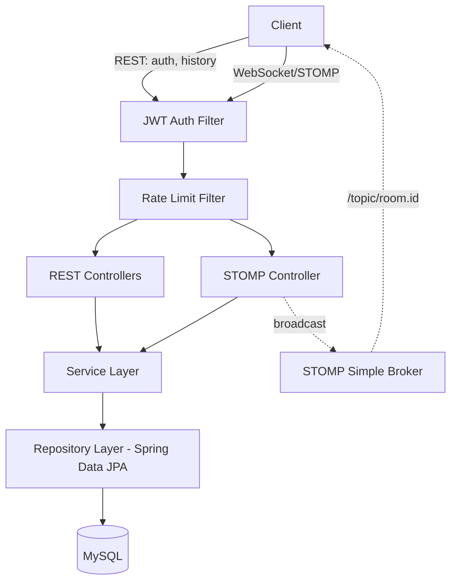
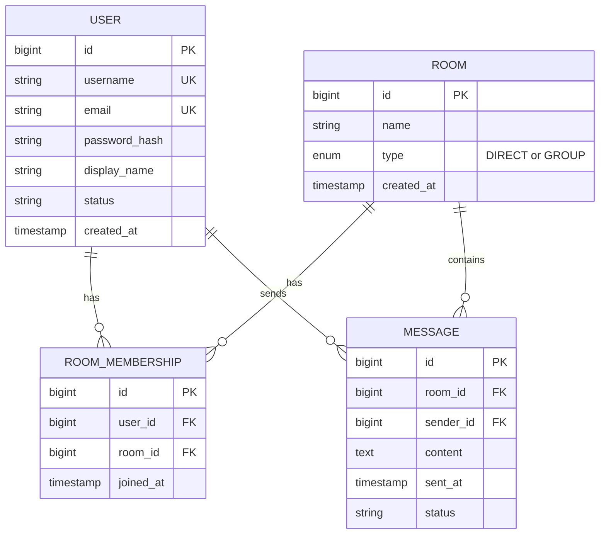

# Real-Time Chat Application Backend

A production-quality, real-time chat backend built with Java 21 and Spring Boot — featuring JWT-secured REST APIs, live messaging over WebSocket/STOMP, presence tracking, rate limiting, and fully interactive API documentation.

Built from scratch as a deep-dive engineering exercise: every architectural decision — from database key strategy to WebSocket authentication to rate-limiting design — was made deliberately and is documented with its reasoning, not just implemented.

---

## Table of Contents

- [Highlights](#highlights)
- [Tech Stack](#tech-stack)
- [Architecture](#architecture)
- [Database Schema](#database-schema)
- [API Reference](#api-reference)
- [WebSocket / STOMP Protocol](#websocket--stomp-protocol)
- [Security](#security)
- [Getting Started](#getting-started)
- [Testing](#testing)
- [Project Documentation](#project-documentation)
- [Known Limitations & Future Work](#known-limitations--future-work)

---

## Highlights

- **Unified data model** for 1-to-1 and group chat — both modeled as a `Room`, eliminating duplicated logic across chat types (the same pattern used internally by Slack, Discord, and Microsoft Teams)
- **Dual-layer authentication** — stateless JWT securing both REST endpoints (via servlet filter) *and* WebSocket connections (via a custom STOMP channel interceptor), two genuinely different Spring pipelines handled correctly
- **Real-time messaging** over WebSocket/STOMP with SockJS fallback, presence tracking driven by Spring's connection lifecycle events (not manual polling)
- **Defense-in-depth authorization** — every message send, history read, and room-join operation independently verifies room membership server-side; nothing is trusted from client input
- **Production-conscious details**: IP-based rate limiting (token bucket via Bucket4j) on auth endpoints, centralized exception handling with correct HTTP status semantics, structured logging with SLF4J, paginated queries backed by purpose-built composite indexes
- **Fully documented API** via springdoc-openapi/Swagger UI, with a hand-maintained WebSocket protocol reference (OpenAPI doesn't cover WebSocket by design)
- **Tested** with JUnit 5 + Mockito unit tests on the service layer, plus a full manual verification pass (Postman + a custom-built browser STOMP client) across every feature

---

## Tech Stack

| Layer | Technology |
|---|---|
| Language | Java 21 |
| Framework | Spring Boot 3.5.16 |
| Real-time messaging | Spring WebSocket + STOMP (SockJS fallback) |
| Security | Spring Security, JWT (JJWT 0.12.6), BCrypt |
| Persistence | Spring Data JPA + Hibernate |
| Database | MySQL 8 |
| API Documentation | springdoc-openapi (Swagger UI, OpenAPI 3.1) |
| Rate Limiting | Bucket4j (token bucket algorithm) |
| Testing | JUnit 5, Mockito, AssertJ |
| Build Tool | Maven |
| Logging | SLF4J / Logback |

---

## Architecture

Deliberately a layered **monolith** — no microservices, no containerization — matching the project's scope of a single-instance, high-clarity backend rather than a distributed system.



**Request flow:** every request — REST or WebSocket handshake — passes through the JWT filter and rate limiter before reaching application code. REST and STOMP controllers both delegate to the same service layer, so business rules (like room membership checks) are enforced identically regardless of which transport a client used.

---

## Database Schema



**Key design choice:** direct (1-to-1) and group chats are both represented as a `Room` — a direct chat is simply a room with exactly two members. This avoids maintaining two parallel implementations of messaging, history, and pagination. `RoomMembership` has a composite unique constraint on `(user_id, room_id)`, and `Message` is indexed on `(room_id, sent_at)` to serve paginated history efficiently at scale.

---

## API Reference

### REST Endpoints

| Method | Endpoint | Auth Required | Description |
|---|---|---|---|
| `POST` | `/api/auth/register` | No | Create a new account |
| `POST` | `/api/auth/login` | No | Authenticate and receive a JWT |
| `POST` | `/api/rooms` | Yes | Create a room (creator is auto-added as a member) |
| `POST` | `/api/rooms/{roomId}/members/{username}` | Yes | Add a member to a room (caller must already be a member) |
| `GET` | `/api/rooms/{roomId}/messages?page=&size=` | Yes | Paginated chat history for a room |

**Interactive documentation:** run the app locally and visit `http://localhost:8080/swagger-ui/index.html` for a full interactive OpenAPI 3.1 spec with request/response schemas and a built-in "Try it out" console.

### Example: Register

```http
POST /api/auth/register
Content-Type: application/json

{
  "username": "sathwik",
  "email": "sathwik@example.com",
  "password": "securePassword123",
  "displayName": "Sathwik"
}
```

---

## WebSocket / STOMP Protocol

OpenAPI/Swagger only documents REST — WebSocket has no equivalent industry-standard spec format, so it's documented here directly.

| Destination | Direction | Description |
|---|---|---|
| `/ws` | Client connects | STOMP handshake endpoint (SockJS-wrapped for fallback compatibility) |
| `/app/chat.send` | Client → Server | Send a chat message |
| `/topic/room.{roomId}` | Server → Client | Subscribe to receive live messages for a specific room |
| `/topic/presence` | Server → Client | Subscribe to online/offline status broadcasts |

**Authenticating a WebSocket connection:** unlike REST, the JWT is sent as a **native STOMP header** on the `CONNECT` frame, not an HTTP header — because after the WebSocket upgrade, the connection no longer speaks HTTP.

```javascript
const client = Stomp.over(new SockJS('http://localhost:8080/ws'));
client.connect(
  { Authorization: 'Bearer ' + jwtToken },
  () => {
    client.subscribe('/topic/room.1', (frame) => {
      console.log(JSON.parse(frame.body));
    });
    client.send('/app/chat.send', {}, JSON.stringify({
      roomId: 1,
      content: 'Hello!'
    }));
  }
);
```

**Message flow:** `SEND` → server validates the sender is a room member → message is persisted to MySQL → **then** broadcast to `/topic/room.{roomId}`. Persisting before broadcasting guarantees no message is ever shown as delivered without also being durably saved.

---

## Security

- **Password storage:** BCrypt with automatic per-password salting — never plaintext, never logged
- **Authentication:** stateless JWT (24-hour expiry), validated on every request via a custom servlet filter (REST) and a custom STOMP channel interceptor (WebSocket)
- **Authorization:** room membership is verified server-side on every message send, history fetch, and member-add call — client-supplied room IDs are never trusted implicitly
- **Rate limiting:** 5 requests/minute/IP on `/api/auth/login` and `/api/auth/register`, implemented with Bucket4j's token bucket algorithm, to slow brute-force and spam-registration attempts
- **Enumeration resistance:** login returns an identical error for "user not found" and "wrong password," preventing username enumeration via error-message differences
- **Stateless by design:** `SessionCreationPolicy.STATELESS` — no server-side session state anywhere, simplifying horizontal scaling of the stateless layers

---

## Getting Started

### Prerequisites
- Java 21 (JDK)
- Maven (or use the included `mvnw` wrapper)
- MySQL 8 running locally

### Setup

1. Clone the repository:
```bash
git clone https://github.com/balasathwiknagothu/chat-app-backend.git
cd chat-app-backend
```

2. Configure your database credentials in `src/main/resources/application.properties`:
```properties
spring.datasource.url=jdbc:mysql://localhost:3306/chat_app_db?createDatabaseIfNotExist=true
spring.datasource.username=root
spring.datasource.password=YOUR_PASSWORD
```

3. Build and run:
```bash
./mvnw clean install
./mvnw spring-boot:run
```

4. The server starts on `http://localhost:8080`. Visit `http://localhost:8080/swagger-ui/index.html` to explore the API.

---

## Testing

```bash
./mvnw test
```

Unit tests use JUnit 5 and Mockito to test the service layer in isolation (mocked repositories, no live database) — covering registration success/failure paths and login success/failure paths, including credential-mismatch handling.

Beyond automated tests, the full request lifecycle — registration, login, room creation, real-time message send/receive, presence updates, pagination, rate limiting, and every error path — was manually verified end-to-end using Postman for REST and a custom-built browser-based STOMP test client for WebSocket flows.

---

## Known Limitations & Future Work

Documented honestly rather than hidden:

- **No read receipts or typing indicators** — deliberately scoped out of MVP; the `Message.status` field exists as a forward-compatible extension point
- **`ddl-auto=update`** instead of a versioned migration tool (Flyway/Liquibase) — acceptable for active development, not production-safe, since schema changes aren't tracked or reversible
- **In-memory Simple Broker** for STOMP message routing — correct for a single-instance deployment, but would need to be swapped for an external broker (e.g., RabbitMQ via STOMP relay) to support horizontal scaling across multiple server instances
- **No file/image attachments** in messages — text-only in the current scope

---

## License

This project was built as a personal learning and portfolio project.
